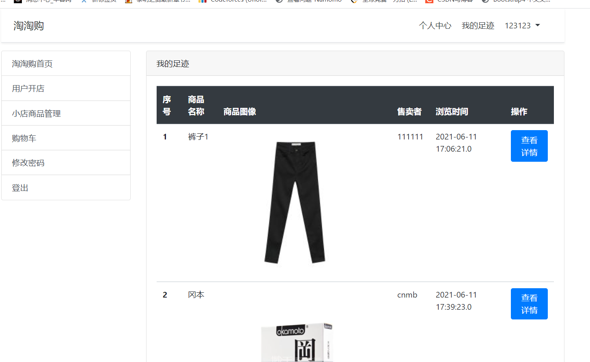

姓名：章鑫鹏 学号：190110910435 班级：19计算机1班

## 一、系统设计

### 1.系统的主要目标

实现类似淘宝的购物网站

### 2.项目的功能说明

（1）用户登录注册修改密码，每一个用户都可以开店成为商家
（2）商品展示功能，可以看见所有的商品 
（3）可以查看商品详情
（4）登录后可以直接购买商品
（5）登录后可以添加商品到购物车
（6）可以查看自己的购物车，在购物车中可以购买商品，删除商品
（7）可以修改密码
（8）开店后可以管理自己的商品（包括添加新商品，商品上下架，修改商品价格和数量等）
（9）可以查看自己曾经浏览过的商品
（10）可以查看自己的个人信息
（11）可以对已经购买的商品进行评论
（12）用户可以在商品的详细信息界面看见已经购买过的用户的评论
（13）商品数量购买后会减少，所有操作基本实现同步，商品数量不够会提示
（14）购买成功后可以看见花费，同时三秒自动跳转
（15）购买和添加到购物车是通过script和模态框实现的
（16）限制了没有开店的用户进行关于小店的操作

### 二、详细设计说明

#### 1、数据库(mongodb)说明

数据库名称：190110910435

本数据库共6张表，如下所示

buyhistory:购买历史记录表

goods:商品表

tracks:浏览记录表

user:用户信息表

userreply:用户评论表

usershopping:用户购物车表

表buyhistory购买历史记录表，其主要字段如下

| 字段名称 | 数据类型 | 中文说明 |
| -------- | -------- | -------- |
| id       | String   | 编号     |
| username | String   | 用户名   |
| goodid   | String   | 商品编号 |
| time     | String   | 购买时间 |
| photo    | String   | 商品图片 |
| status   | Number   | 评论状态 |

表goods商品表，其主要字段如下

| 字段名称  | 数据类型 | 中文说明 |
| --------- | -------- | -------- |
| id        | String   | 编号     |
| username  | String   | 用户名   |
| goodsname | String   | 商品名称 |
| price     | Number   | 商品价格 |
| number    | Number   | 商品数量 |
| photo     | String   | 商品图片 |
| status    | Number   | 上架状态 |

表tracks浏览记录表，其主要字段如下

| 字段名称  | 数据类型 | 中文说明 |
| --------- | -------- | -------- |
| id        | String   | 编号     |
| username  | String   | 用户名   |
| goodsname | String   | 商品名称 |
| goodid    | String   | 商品编号 |
| clicktime | String   | 浏览时间 |
| photo     | String   | 商品图片 |

表user用户信息表，其主要字段如下

| 字段名称 | 数据类型 | 中文说明     |
| -------- | -------- | ------------ |
| username | String   | 账号         |
| password | String   | 密码         |
| sex      | String   | 性别         |
| email    | String   | 邮箱         |
| regtime  | String   | 注册时间     |
| address  | String   | 收货地址     |
| headimg  | String   | 头像         |
| manager  | Number   | 是否成为商家 |

表userreply用户评论表，其主要字段如下

| 字段名称 | 数据类型 | 中文说明 |
| -------- | -------- | -------- |
| id       | String   | 编号     |
| username | String   | 用户名   |
| goodid   | String   | 商品编号 |
| time     | String   | 评论时间 |
| text     | String   | 评论内容 |

表usershopping用户购物车表，其主要字段如下

| 字段名称  | 数据类型 | 中文说明 |
| --------- | -------- | -------- |
| id        | String   | 编号     |
| username  | String   | 用户名   |
| goodid    | String   | 商品编号 |
| number    | Number   | 数量     |
| goodsname | String   | 商品名称 |
| price     | Number   | 商品价格 |

## 三、引入的包说明

1. ejs：使用ejs渲染页面（如<%= data %>）

2. Mongoose：自己封装的一个mongoose CURD模块

3. express：Web 开发框架

4. session：将一些不变的参数放入session（如user）可以减少查询次数

5. path：用来获得文件的扩展名等

6. multer：上传文件
7. 
8. bodyParser：处理前端 Post 提交的数据

9. lodash：给 list 按某一个属性排序

## 四、项目目录结构和各个部分的说明

1. modules：mongodb的连接，CURD，实体类
2. node_modules：存放导入的包
3. pubilc：公共资源
4. static：静态资源，我用来放用户上传的头像以及上传的商品图片
5. views：视图，存放 ejs web文件
6. app.js：主程序

## 五、使用说明书

欢迎界面

商品展示界面

购买界面

加入购物车

商品详细信息

用户评论

用户登录界面

用户注册界面

用户个人信息

小店管理

添加新商品

修改商品属性

我的足迹

我的购物车

修改密码

注册成功

新用户开店

商家守则

支付成功页面

购物历史

评价界面

