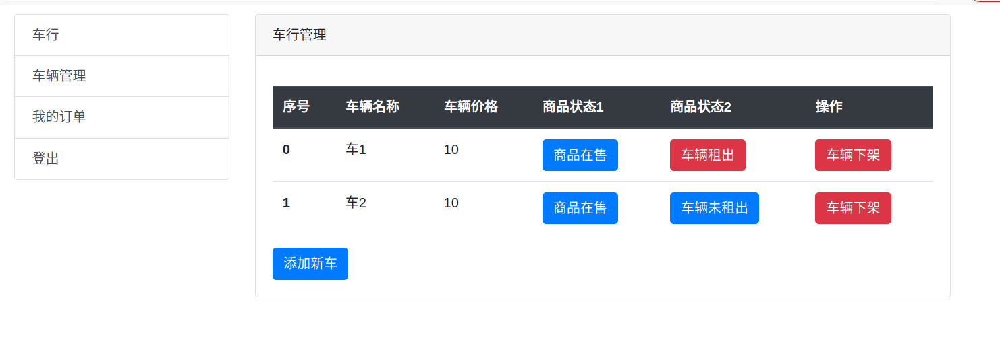

姓名：宋瑞涛学号：190110910421 班级：19计算机2班

## 一、系统设计

### 1.系统的主要目标

实现借车系统

### 2.项目的功能说明

- 用户登录注册修改密码，分管理员和非管理员
- 商品展示功能，可以看见所有的商品 
- 可以修改密码
- 限制了没有普通用户进行关于车的操作
- 可以借车
- 可以还车
- 管理员可以增加车辆
- 管理员可以上下架车辆

### 二、详细设计说明

#### 1、数据库(mongodb)说明

数据库名称：190110910421

本数据库共3张表，如下所示

borrowcar:借车表

car:商品表

user:用户表

表borrowcar借车表，其主要字段如下

| 字段名称  | 数据类型 | 中文说明 |
| --------- | -------- | -------- |
| id        | String   | 编号     |
| username  | String   | 用户名   |
| goodsname | String   | 商品名称 |
| time      | String   | 购买时间 |
| photo     | String   | 商品图片 |

表car商品表，其主要字段如下

| 字段名称  | 数据类型 | 中文说明 |
| --------- | -------- | -------- |
| id        | String   | 编号     |
| goodsname | String   | 商品名称 |
| price     | Number   | 商品价格 |
| status1   | Number   | 上架状态 |
| photo     | String   | 商品图片 |
| status2   | Number   | 租借状态 |

表user用户信息表，其主要字段如下

| 字段名称 | 数据类型 | 中文说明     |
| -------- | -------- | ------------ |
| username | String   | 账号         |
| password | String   | 密码         |
| sex      | String   | 性别         |
| email    | String   | 邮箱         |
| regtime  | String   | 注册时间     |
| manager  | Number   | 是否是管理员 |

## 三、引入的包说明

1. ejs：使用ejs渲染页面（如<%= data %>）

2. Mongoose：自己封装的一个mongoose CURD模块

3. express：Web 开发框架

4. session：将一些不变的参数放入session（如user）可以减少查询次数

5. path：用来获得文件的扩展名等

6. multer：上传文件
7. 
8. bodyParser：处理前端 Post 提交的数据

9. lodash：给 list 按某一个属性排序

## 四、项目目录结构和各个部分的说明

1. modules：mongodb的连接，CURD，实体类
2. node_modules：存放导入的包
3. pubilc：公共资源
4. static：静态资源，用来放上传的商品图片
5. views：视图，存放 ejs web文件
6. app.js：主程序

## 五、使用说明书

登录界面

注册界面

借车界面

还车界面

车辆管理界面

## 六、开发日记

